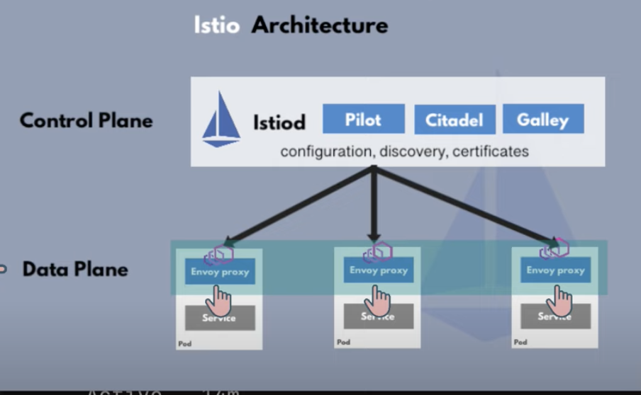

# Guide to install and to execute an example of use Istio 

## Architecture 

## Preparation 
- https://istio.io -> curl -L https://istio.io/downloadIstio | sh - 
- istioctl working where you have the folder 

## Install in minikube cluster 

- minikube start --cpus 6 --memory 8192
- istioctl install -> Istallation of Istio Istiod Ingress gateway
- kubectl label namespace default istio-injection=enabled -> per avviare l'injection dei proxy di default  
- [Projects-demo](https://github.com/GoogleCloudPlatform/microservices-demo/tree/main/release) -> kubernetes-manifest.yaml 
- kubectl apply -f kubernetes-manifest.yml

## Collection Metrics 
### Inside the installation's folder of Istio you can fine some samples about integration with metric's applications such as: Prometheus, Grafana, Jaggers. 
- kubectl apply -f istio-1.16.1/samples/addons 
- kubectl get svc -n istio-system
#### PROMETHEUS 
- kubectl port-forward svc/prometheus  -n istio-system 9090
    #### KIALI
- kubectl port-forward svc/kiali  -n istio-system 20001

